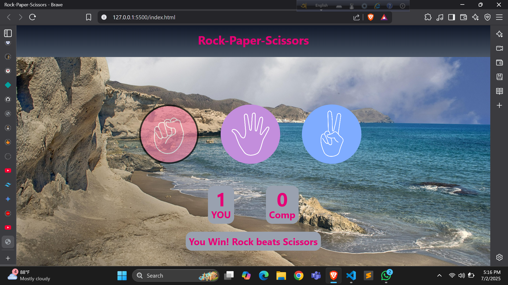
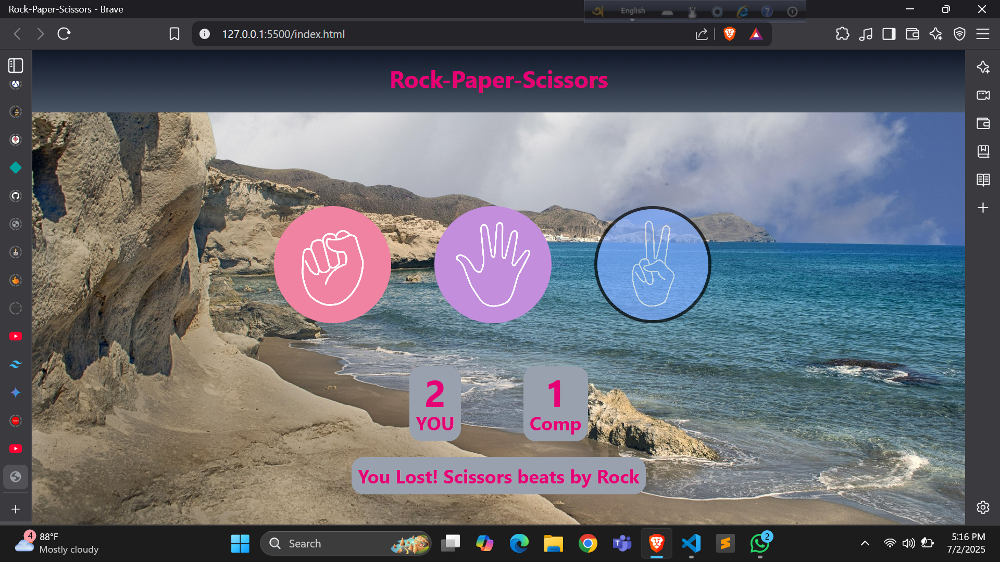
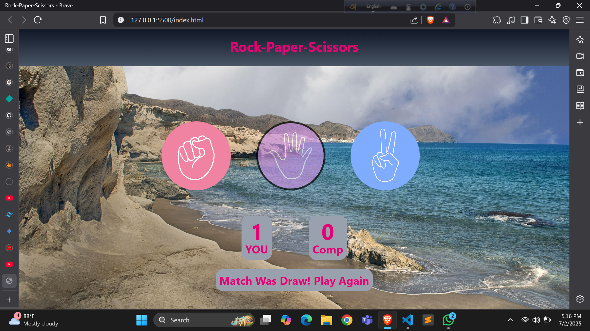

# ✂️ Rock-Paper-Scissors Game 

A simple web-based Rock-Paper-Scissors game built with **HTML, CSS, and JavaScript**.






## 🚀 Features
- Interactive UI with hover effects
- Score tracking for player vs computer
- Responsive design (works on mobile/desktop)

## 🛠️ Technologies Used
- HTML5
- Tailwind CSS
- Vanilla JavaScript

## 📥 Installation
1. Clone the repository:
   ```bash
   git clone https://github.com/Koushik032/Stone_Paper_Scissors-Game.git
   ```
2. Open `index.html` in your browser.

## 🎮 How to Play
1. Click on Rock, Paper, or Scissors.
2. Computer randomly selects its move.
3. Winner is announced instantly!

## 👨‍💻 Author
[Koushik Roy]  
[https://github.com/Koushik032]